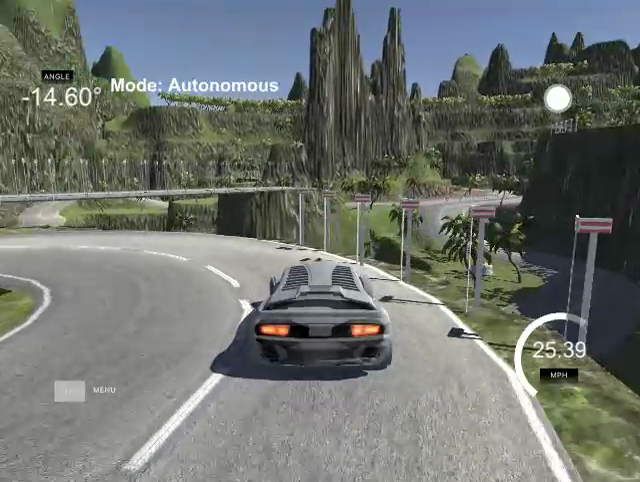

# Behavioral Cloning
This is a Udacity Self-Driving Car NanoDegree project submission that uses deep learning to clone driving behavior.

## Installation
Clone or fork this repository. For dependencies, see `env-bcl-gpu.yml` for packages. Also requires
[Udacity's Self-Driving Car Simulator](https://github.com/udacity/self-driving-car-sim).

## Usage
Intended user is the Udacity evaluator for this project. To view a video recording of the vehicle autonomously driving around a simulated mountainous track from the perspective of a camera mounted at the center of the vehicle, play the following mp4:

`video.mp4`

To directly observe the vehicle autonomously driving from a third person view, do the following:

1. Start the autonomous driver: `python drive.py model.h5`
2. Start Udacity's Self-Driving Car Simulator (SDCS), and click the play button.
3. Select track to drive on in the SDCS.
4. Select Autonomous Mode in the SDCS. This connects the simulator to `drive.py` which drives the car around the selected track based on the machine learning model captured in `model.h5`.

## Files
### Project Files
- `model.py`: Python script used to create and train the model.
- `drive.py`: Python script used to autonomously drive the car.
- `model.h5` : The saved model.
- `writeup_report.md`: writeup of project for Udacity evaluator.
- `video.mp4`: video recording of vehicle driving around track 2 in the opposite direction.

### Other files 
- `data_easy_route_7z`: contains training data compressed into multiple .7z files consisting of driving log and images of recording of vehicle driving around track_1; __uncompress .7z files into base folder to use in training__
- `data_hard_route_7z`: contains training data compressed into multiple .7z files consisting of driving log and images of recording of vehicle driving around track_2; __uncompress .7z files into base folder to use in training__
- Additional videos from 3rd person perspective:
  - `auto_easy_3p.mp4`: driving around track 1.
  - `auto_easy_rev_3p.mp4`: driving in opposite direction around track 1.
  - `auto_hard_3p.mp4`: driving around track 2.
  - `auto_hard_rev_3p.mp4`: driving in opposite direction around track 2.  
- Additional videos from driver perspective:
  - `auto_easy.mp4`: driving around track 1.
  - `auto_easy_rev.mp4`: driving in opposite direction around track 1.
  - `auto_hard.mp4`: driving around track 2.
- `env-bcl-gpu.yml`: YAML file for installing other packages in a Conda environment.
- `proto.ipynb`: Jupyter Notebook for prototyping python and markdown code.
- `training_log.csv`: CSV file showing training history of `model.h5`.
- `video.py`: Udacity included script for generating video of vehicle driving.